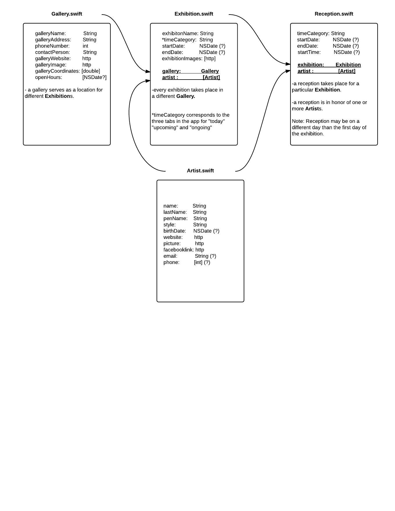
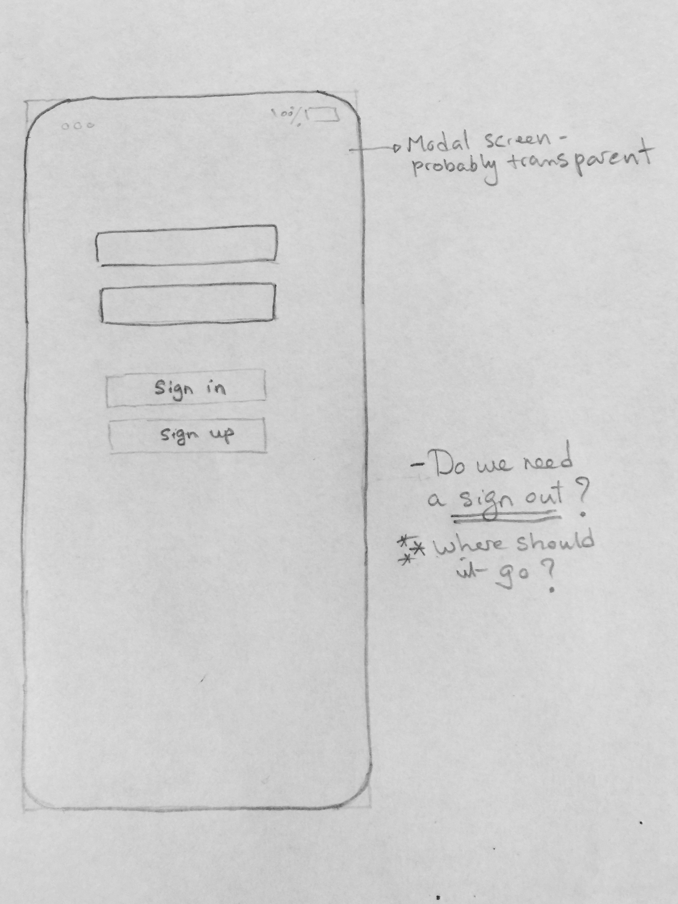
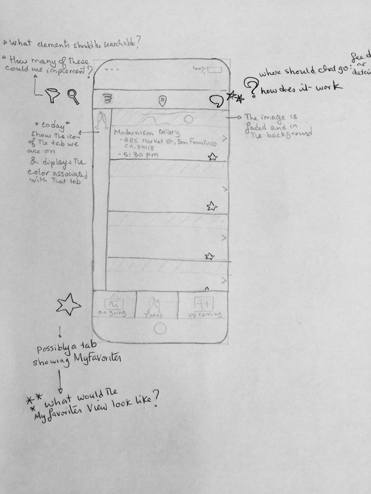
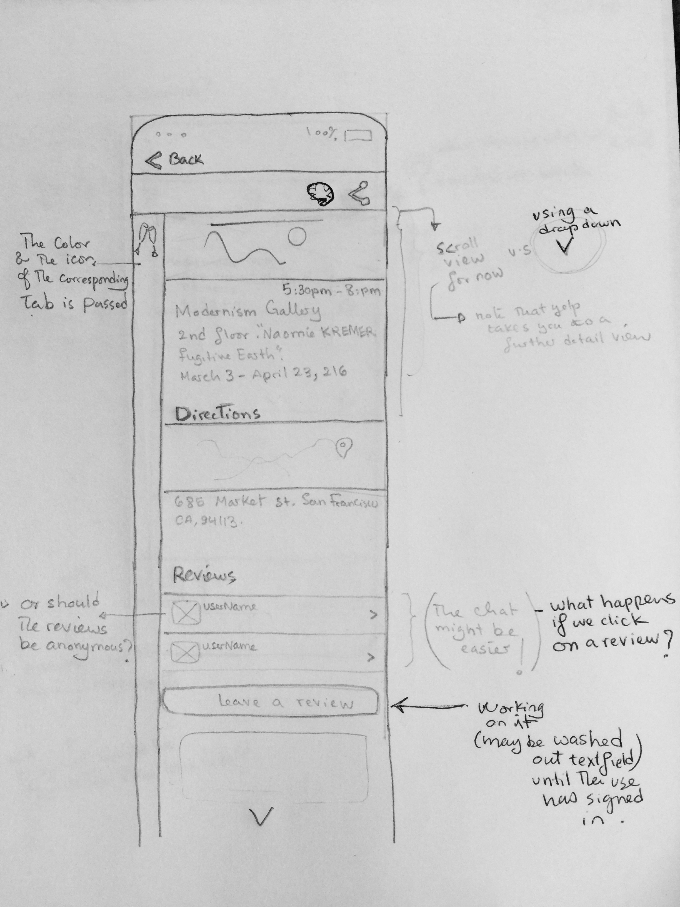
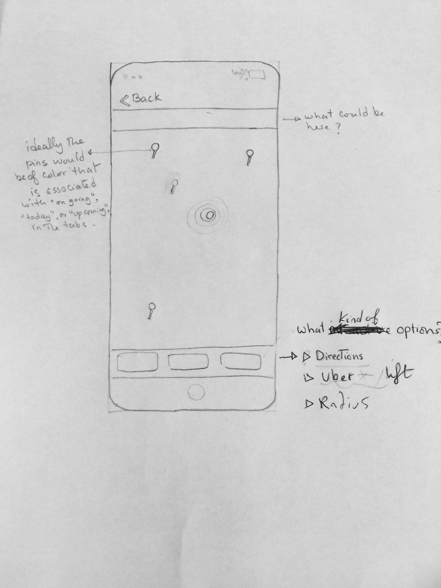
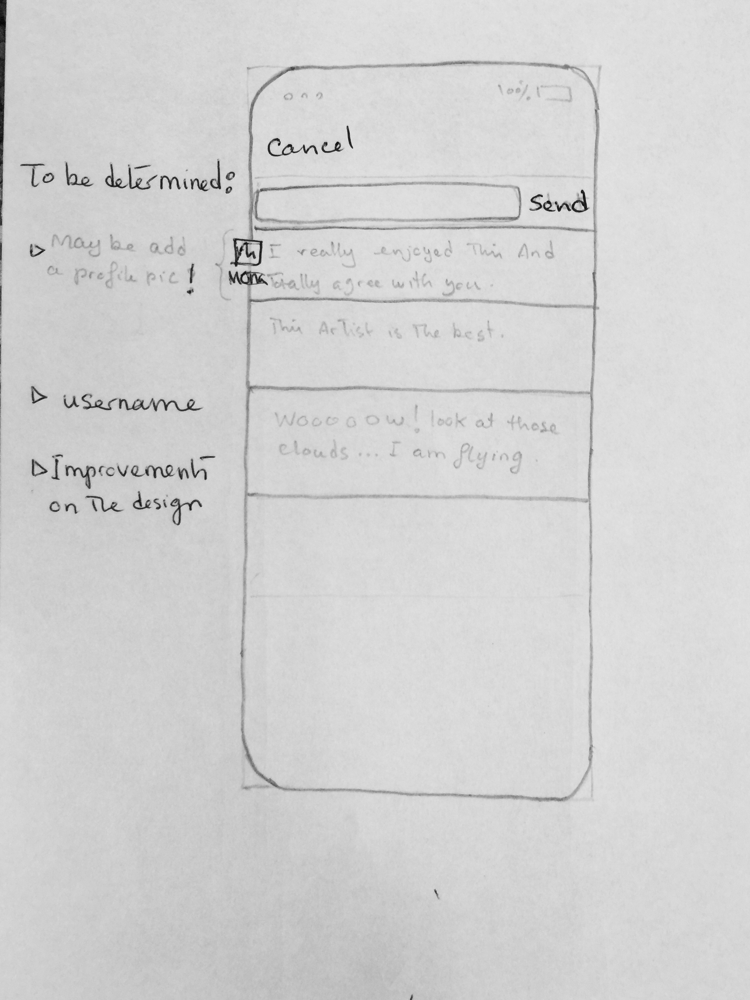
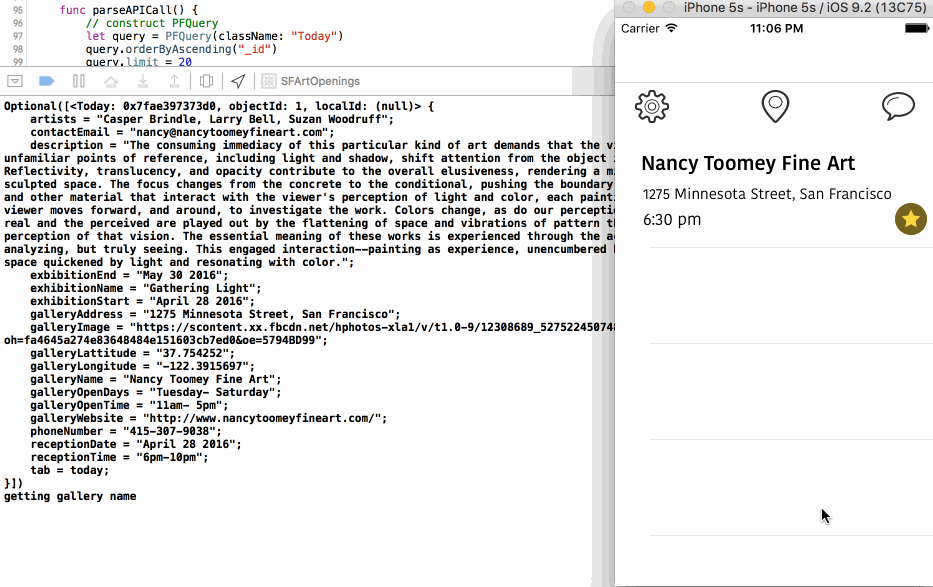
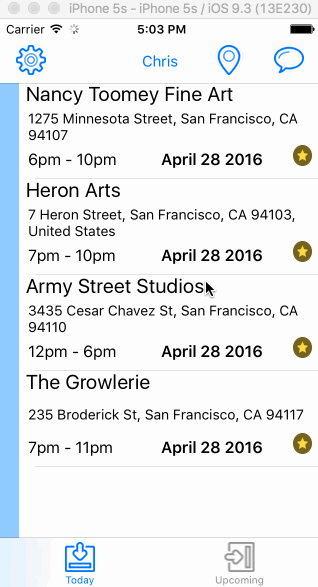

# Group-Project
Group project for CodepathU

The App
SFArtOpenings is an app that allows the user to find current and upcoming art openings and ongoing art exhibits in San Francisco. It allows users to get directions to events,  to chat with others at the event and to leave reviews

## User Stories
Required User Stories:
- [x] User can view a TableView of art galleries.
- [x] User can choose between Today and upcoming tabs.
- [x] Different tabs are color coded.
- [x] For each event on the tableview, user can see the Gallery, its address, and time for the reception.
- [x] User can tap on each event to see details about it in a separate view.
- [x] On the details view, user finds a picture of the galleyr, the name of the exhibition for which there is a reception, the time of the reception, a description of the exhibition, and a map. 
- [x] User can click on the map in the details view to get directions. 
- [x] Once at the event, user can chat with other people at the event.
- [x] In order to chat, user must sign up/in.
- [x] User can sign out.

Potential User stories:
- [ ] User can see a map of today's events
- [ ] User can pull to refresh the events list.
- [ ] User can search for an event (by either gallery or artist name).
- [ ] User can filter different events.
- [ ] User can upload a picture for his or her chatting profile.
- [ ] User can leave reviews about an event.

## Schema

## Wireframes

| Login  | Feed | Detail |
| --- | --- | --- |
|  |  |  |

| Map | Chat |
| --- | --- |
|  |  | 

## Walkthrough
33 percent

66 percent

100 percent

