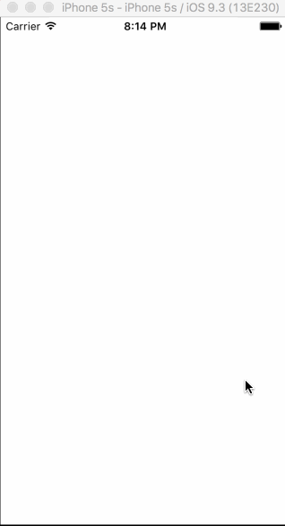

# Group-Project
Group project for CodepathU

The App
SFArtOpenings is an app that allows the user to find current and upcoming art openings and ongoing art exhibits in San Francisco. It allows users to get directions to events,  to chat with others at the event and to leave reviews

## User Stories
Required User Stories:
- [ ] User can view a TableView of art gallery opening receptions currently happening in San Francisco from Parse reflecting Alan Bamberger’s Art Business.com “San Francisco Art Openings Calendar.”
- [ ] In the event list, user can view event with the gallery picture, gallery name, partial exhibit description, and time and date of opening reception. 
- [ ] Custom cell should be designed with the proper Auto Layout settings.  
- [ ] User can search and Search bar should be in the navigation bar.
- [ ] User can select from a tab bar for either “(Reception) Today,” “Upcoming,” or “Ongoing” art exhibits
- [ ] Table rows should have dynamic height (although content needs to get cut off because it’s usually large).

- [ ] User can view event details by tapping on a cell.
- [ ] In the detail page, user can view event with the gallery picture, gallery name, full exhibit description, and time and date of opening reception, and a map view of the particular event. Custom cell should be designed with the proper Auto Layout settings.

Potential User stories:
- [ ] User sees a loading state while waiting for the event calendar.
- [ ] User can pull to refresh the events list.
- [ ] User can search for an event (by either gallery or artist name).
- [ ] Implement map view of event results.

Possible User stories:
- [ ] User can see filtered data.
- [ ] User can sign in, but should be able to see the event list even without signing in.
- [ ] The current signed in user will be persisted across restarts.
- [ ] User can use 3D touch to see an explanation of the different elements in the tab bar.
- [ ] User can leave reviews about an event.
- [ ] User can chat with other users in the same location (Geo-tagging)

## Schema

## Wireframes

| Login  | Feed | Detail |
| --- | --- | --- |
|  |  |  |

| Map | Chat |
| --- | --- |
|  |  | 

## Walkthrough
33 percent

66 percent

